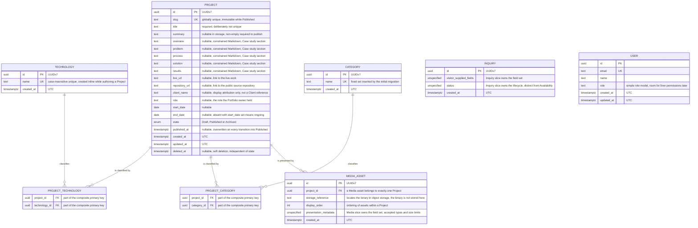

# Portfolio V3 entity relationship diagram

This document describes the **current logical data model** for Portfolio V3 — the
entities the documentation has actually settled, and how they relate.

It is not a Drizzle schema, not a migration plan, and not a forecast of what the model
becomes in later slices. Where the documentation deliberately leaves a field set open,
the diagram says so rather than guessing.

Sources: `CONTEXT.md` (canonical terminology), `docs/spec/portfolio-v3.md`,
`docs/spec/portfolio-v3-implementation.md`, `docs/development.md`, and ADRs
[0002](../adr/0002-postgresql-as-source-of-truth.md),
[0004](../adr/0004-public-and-administrative-api-boundaries.md),
[0005](../adr/0005-object-storage-for-media.md),
[0006](../adr/0006-cookie-based-authentication.md),
[0007](../adr/0007-structured-project-content.md),
[0010](../adr/0010-taxonomy-separate-from-service-offer.md),
[0012](../adr/0012-project-lifecycle-transitions-and-publish-rule.md).

## Diagram

## Model notes

**Case study is not a separate entity.** It is a domain concept (`CONTEXT.md`) realised
as five fixed, individually optional Markdown columns on `PROJECT` — `overview`,
`problem`, `process`, `solution`, `results`, in that order. ADR-0007 settles fixed
structured sections over a generic content-block editor, and its "modular enough to
evolve toward ordered content blocks later" is satisfied by columns that can be migrated
into a blocks table if real content requirements ever justify it. A section child table
with an ordinal *is* the block editor ADR-0007 deferred, so it is deliberately absent.

**`USER` has no relationship to `PROJECT`.** There is no authorship, ownership or
`created_by` edge, because the settled Project field set contains no such column.
Management access is an authorization boundary (ADR-0004), not a data relationship: a
User is a person who can access private management functionality, and the first
production system is optimised for one practical Portfolio owner while the model stays
capable of holding more than one User. `USER` therefore stands alone here on purpose.

**`USER` is the only authentication-related entity shown, and its table is not
project-owned.** The authentication infrastructure (ADR-0006, HTTP-only cookie sessions)
owns the user, session, account and verification tables, and credentials live in the
account record rather than on the User row. Sessions, accounts and verification records
are infrastructure state, not Portfolio domain concepts, so they are out of the diagram;
`USER` appears because **User** is canonical domain language. The `users` table
currently in `apps/api/src/db/schema.ts` is foundation scaffolding and does not yet
reflect this.

**Technology and Category are separate concepts with deliberately asymmetric
provenance.** A Technology classifies a Project technically; a Category describes the
professional nature of the work (`CONTEXT.md`, ADR-0010). Both are name-only — no slug,
description, icon, display order or featured flag, because those presentation fields
belong to **Service**, a different concept. Technology rows are created inline while
authoring a Project; the Category set is fixed by the initial migration and has no
creation path. Neither carries a soft-delete or updated timestamp, because neither has a
delete or rename path yet.

**The two join tables carry no payload.** `PROJECT_TECHNOLOGY` and `PROJECT_CATEGORY`
are plain link tables whose primary key is the pair of foreign keys. There is no
per-relationship ordering, weighting or role. Both relationships are optional in storage
— a Draft can be saved with neither — while the publish rule requires at least one
Category. Technology stays optional even when a Project is Published.

**Minimum cardinalities live in the publish rule, not in the schema.** Only `title` and
the system-managed fields are non-nullable, so a Draft can be saved half-written. The
`canPublish` predicate (ADR-0012) is what requires `summary` non-empty, at least one of
the five Case study sections non-empty, and at least one Category before a Project may
become Published. Reading the diagram as "summary is optional" is correct about storage
and wrong about anything public.

**Lifecycle state and soft deletion are independent columns.** `state` carries Draft,
Published and Archived; `deleted_at` carries soft deletion. Conflating them would make
archival and deletion the same act, which the specification explicitly separates.
`deleted_at` is present although no endpoint writes it yet, so that every Project query
is written with the soft-delete filter from the first line of code. `published_at` is
the most recent publication time and is overwritten on every transition into Published,
not fixed at the first.

**`slug` is the public identifier; `id` is not.** The slug carries the uniqueness
constraint that `title` deliberately does not, and it is the key the public API and the
public routes address a Project by. Internal ids, lifecycle state and the bookkeeping
timestamps are never part of a public representation — the public shape is a separate
contract from the stored row, which is the representation boundary the specification
requires.

**Media asset rows are metadata and relationship only.** The binary lives in
S3-compatible object storage (ADR-0005); the database stores where it is and how it is
presented. Object-storage objects are not modelled as entities because they are not
relational data. `storage_reference`, `display_order` and the presentation-metadata
placeholder record the *shape* the documentation commits to — a Media asset belongs to
one Project, is ordered within it, and carries presentation metadata — while the actual
field set, accepted types and size limits belong to the Media slice and are not yet
specified.

**`INQUIRY` is deliberately thin.** An Inquiry is validated and persisted before
notification handling, is reviewable by the owner afterwards, and the data model is
required to support a richer workflow later without becoming a CRM. Its concrete field
set and status model belong to the Inquiry slice and have not been decided, so the
diagram names the two open areas rather than inventing columns.

**Inquiry is not Client, and Client is not in this model.** A **Client** is an
established professional relationship; an Inquiry does not create one, and neither does
`project.client_name`, which is display attribution only. **Client**, **Service** and
**Availability** are canonical glossary concepts with no current implementation path, so
none of them is an entity here. If Client becomes real it joins as a nullable foreign
key *alongside* `client_name`, which remains the fallback for Projects that never gain
one.

**Conventions not visible in the diagram.** Identifiers are UUIDv7. System timestamps
are stored in UTC. String length limits are enforced by request validation at the API
boundary rather than by column types, so every text column is a plain text column and
the caps live in one place. Constrained Markdown means paragraphs, bold, italic, links
and unordered lists — no headings, images or raw HTML.
