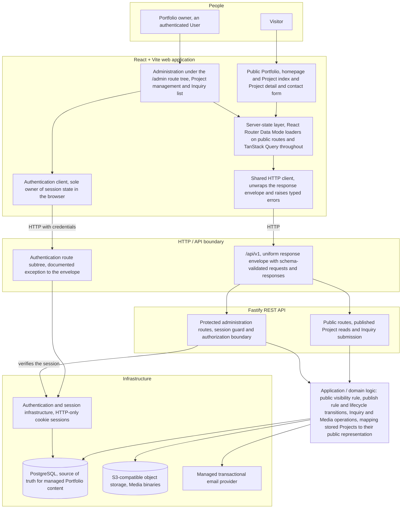
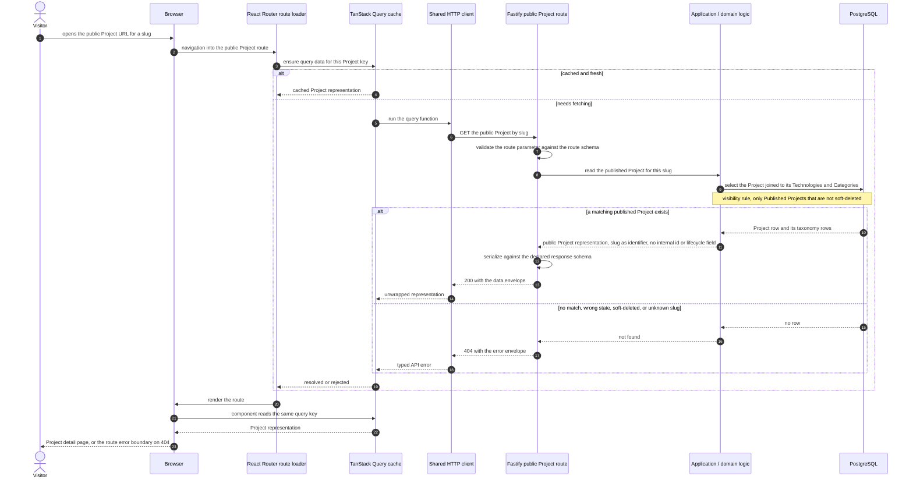
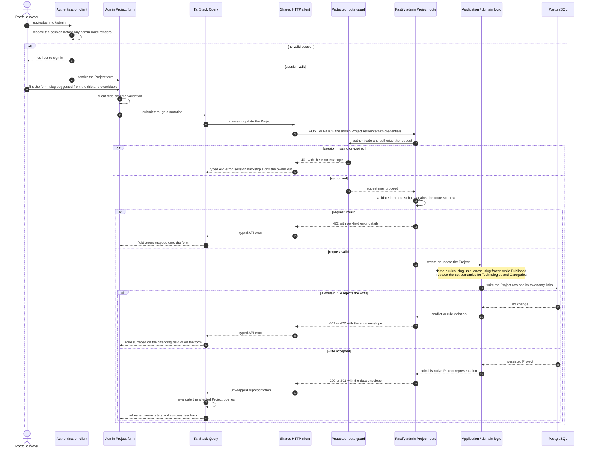
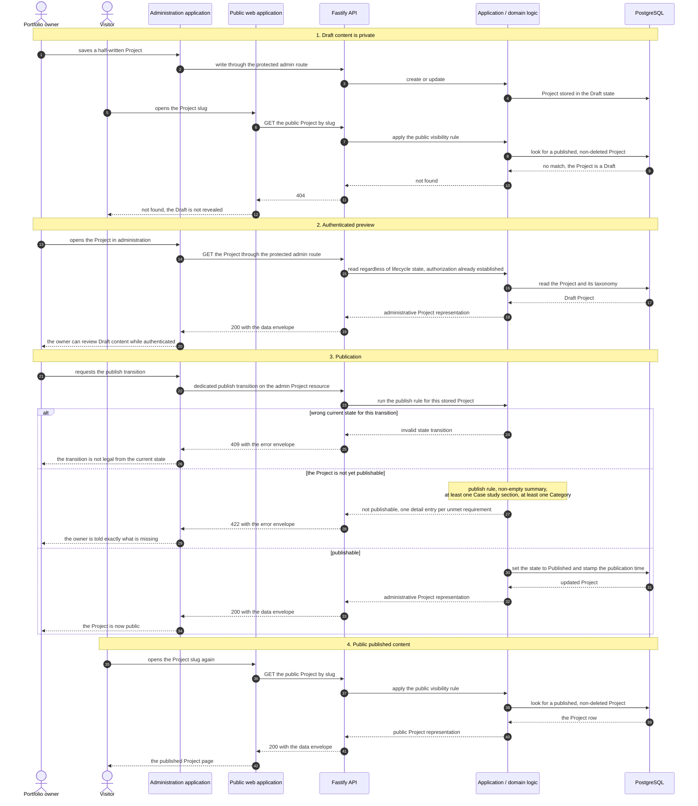
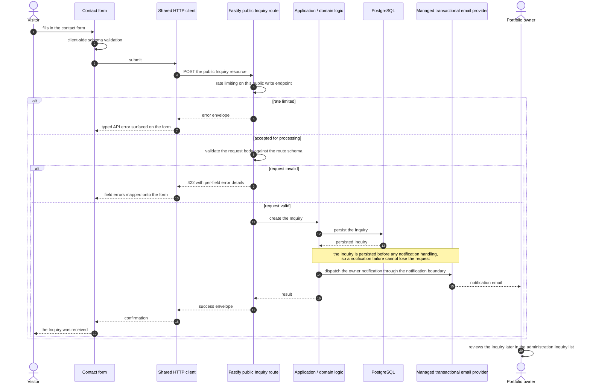
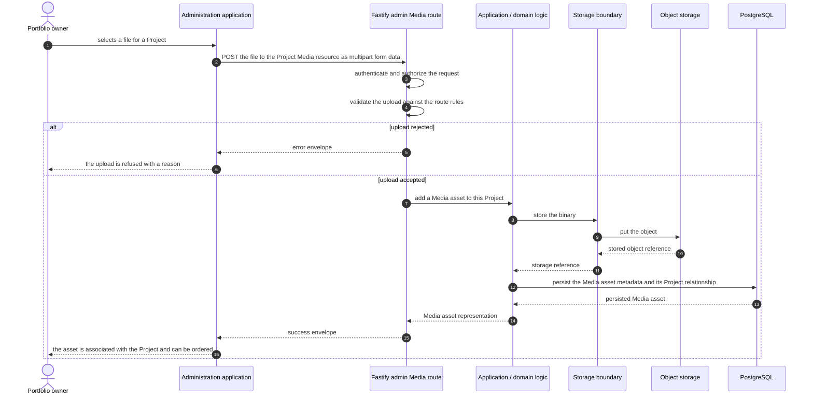

# Portfolio V3 system flow

How the full-stack application fits together, and what happens when it is used.

Each diagram answers one question and reflects the **current** architecture and the
current milestone. Where the documentation describes an eventual direction rather than
what is being built, it is labelled as future in the surrounding notes and kept out of
the current-state diagrams.

Sources: `CONTEXT.md`, `STACK.md`, `docs/spec/portfolio-v3.md`,
`docs/spec/portfolio-v3-implementation.md`, `docs/development.md`, and the accepted
ADRs under `docs/adr/`. The companion data model is [`erd.md`](./erd.md).

## System architecture

The five primary seams are the public web application, the HTTP/API boundary, the
application/domain boundary, the infrastructure boundary, and the public content
representation boundary. This diagram shows responsibilities and boundaries, not file
structure.

Notes on the boundaries:

- The public Portfolio and the administration application are **one** React
  application; administration lives under an `/admin` route tree.
- The web application holds no competing authoritative copy of Portfolio content. Page
  structure, animation and art-directed presentation stay developer-owned; managed
  content comes from the API.
- Route handlers own transport concerns — request validation, authentication checks,
  status codes, response serialization. Meaningful rules live in application/domain
  code. Provider and persistence concerns live in infrastructure-facing code.
- Public reads and protected administrative mutations are explicit authorization
  boundaries inside one API application (ADR-0004).
- The authentication subtree emits its own response shape and is reached through the
  authentication client rather than the shared HTTP client, so it never passes through
  the envelope path (ADR-0011).
- WebGL and motion are progressive enhancement inside the web application (ADR-0008);
  they are not a system boundary and so do not appear here.

## Public Project request

A visitor opening a published Project detail page. The index follows the same path
against the collection endpoint.

Notes:

- Public routes are loader-driven: the loader primes the cache and the component reads
  the same key, which is what keeps prerendering the public Project pages possible
  later (ADR-0013). Pending and error states on public routes use React Router's own
  navigation state and error boundary.
- The public representation is a separate contract from the stored row. The response
  schema is what actually leaves the process, so internal fields cannot leak by
  accident.
- A Draft, an Archived, a soft-deleted and a nonexistent Project are indistinguishable
  from outside — all four are the same 404, so no hidden work is revealed.
- The public Project index is unpaginated and unfiltered at this stage, ordered by most
  recent publication. Pagination, filtering and server-side caching are future
  additions, and the envelope leaves room for pagination metadata without a breaking
  change.

## Admin Project workflow

An authenticated Portfolio owner creating or updating a Project.

Notes:

- Administration routes are component-driven: components fetch and mutate, and
  invalidation on success is the single cache-invalidation path (ADR-0013). Pending and
  error states here come from the query layer, not from router navigation state.
- Authentication is checked twice on purpose — once before the admin subtree renders,
  and once by the HTTP client as a backstop for a session that expires mid-screen.
  Neither replaces the server-side guard, which is the actual authorization boundary.
- Server-side validation is independent of the form's validation. The backend does not
  trust the browser.
- Technologies are created inline from this form through their own find-or-create
  operation before the Project write, so the Project payload carries identifiers only.
  Categories are a fixed set with no creation path.
- The administrative representation is richer than the public one: it is the owner's
  view of the record, including lifecycle state.

## Project publication and preview

Draft, authenticated preview, and public published content are three different things.
This diagram shows all three against one Project.

Notes:

- **Draft content** is reachable only through the protected administration routes.
  **Public published content** is reachable only through the public routes, and only
  while the Project is Published and not soft-deleted. Archived Projects are likewise
  absent from public presentation.
- **Authenticated preview** today is the administration application reading the Project
  through the protected route — the same authorization boundary, not a second one. A
  dedicated authenticated draft preview of the *public* presentation belongs to the
  publishing-and-preview slice; because a slug is allocated at creation, that preview
  will have a stable slug to address a Draft by. Its mechanism is **not yet specified**
  and is deliberately absent from this diagram.
- Lifecycle changes go through dedicated transitions rather than a generic update
  carrying a new state. The legal graph is Draft to Published, Published to Draft,
  Published to Archived, and Archived to Draft (ADR-0012). Unpublishing is what makes a
  frozen published slug correctable.
- Two failure modes stay distinct: a transition requested from the wrong current state
  is a conflict, while failing the publish rule is an unprocessable request carrying one
  detail entry per unmet requirement.
- Publication time is overwritten on every transition into Published.
- The exact transition endpoint paths are finalized during implementation; the
  specification's endpoint list is explicitly illustrative.

## Inquiry submission

A visitor contacting the Portfolio owner, without an account.

Notes:

- The Inquiry is validated and persisted **before** notification handling. Persistence
  is what the visitor's request depends on; the notification is how the owner hears
  about it.
- Notification delivery sits behind its own boundary so that asynchronous processing can
  be introduced later without changing the Inquiry model. There is **no persistent
  background worker or queue** at this milestone, and none is implied here — dispatch is
  initiated within the request.
- Public write endpoints, Inquiry and authentication in particular, are rate limited.
- The Inquiry field set, its status model, the choice of transactional email provider,
  the notification payload and the rate-limiting thresholds are **not yet specified**;
  they belong to the Inquiry slice. This diagram shows only the path the documentation
  has settled.
- An Inquiry does not make its sender a Client.

## Media upload

The current upload path, in which files pass through the API.

Notes:

- The binary lives in object storage; the database stores metadata and the relationship
  to the Project (ADR-0005). No binary is stored relationally.
- The storage boundary is provider-independent on purpose, so the storage provider can
  change without touching Project behaviour.
- **Future direction, not current architecture:** signed direct browser-to-object-storage
  uploads are the eventual path for larger files, and image transformation or CDN
  delivery is a later optimization. Neither is part of the current milestone, and
  managed video infrastructure is deliberately outside the current stack. The diagram
  above is the path being built.
- Accepted media types, size limits, the ordering model and the public Media
  representation are **not yet specified**; they belong to the Media slice.
